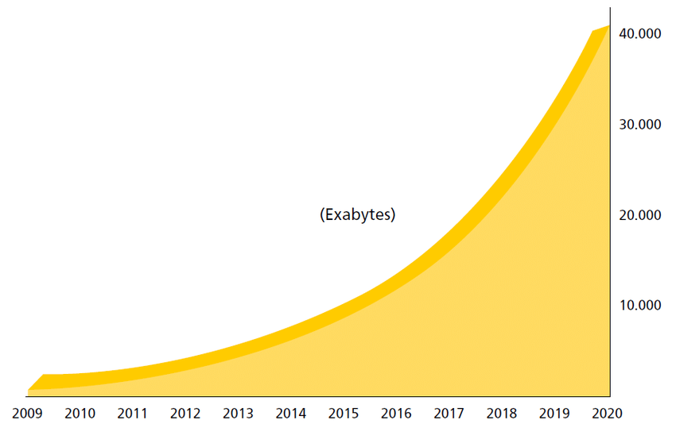

## Affordable way to distill knowledge in the information era

Du Yuefeng

Journal Club Keynote

louisdyf@protonmail.com

Hong Kong, Sep. 2021

---

## Key takeaways

- Refining knowledge distillation procedures
- Memory Hierarchy and "second brain"
- Hopefully improve long-term productivity 

<!-- .element: style="font-size:70%;" -->

---

## World reshaped within decades...

With data, and its processing capability (w.r.t communication and computation) *grows exponentially*.

<!-- .element: style="font-size:70%;" -->

<!-- .element height="350px" -->

----

## Looking back at the history
| Theory | Military dev. | Commercial use
| ----------- | ----------- | ----------- |
| Turing machine in 1936 | Command and Control in 1950s | Internet in 1990s |
| Information theory in 1948 | C2 + Communication in 1960s | Distributed clusters in 2000s |
| | C3 + Intelligence in 1977 | Cloud computing in 2010s |
| | C3I + Computer in late 1980s | IoTs, 5G now |
<!-- .element: style="font-size:70%;" -->

---

## Direct impact on individual study

> There is a limit to our life, but to knowledge there is no limit. With what is limited to pursue after what is unlimited is a perilous thing. (吾生也有涯，而知也無涯，以有涯隨無涯，殆已)

**More accurate version nowadays**:

> There is a limit to our attention, but to effectively distill excessive information we can do much better...

<!-- .element: style="font-size:70%;" -->

---

## More challenges in the new era

> To tell the truth, the whole truth, and nothing but the truth.
- Overwhelmed information sources
    - Fake news for economic incentives and other agenda
    - Selective omission of critical information 
        - Low-quality reproduction
        - Even the most well-intentioned writer could exclude certain elements from the analysis 

<!-- .element: style="font-size:70%;" -->

---

## Generic guidelines on study
0. Motivation is always important
1. What to study/research?
2. Random access in your reading
    - e.g., remember this keynote with just a few keywords
3. Write your own inputs for archiving
4. Reflective thinking

<!-- .element: style="font-size:70%;" -->
---

## Funny Limerick

> There once was an old man from Esser,
>
> Whose knowledge grew lesser and lesser.
>
> It at last grew so small,
>
> He knew nothing at all,
>
> And now he's a college professor.
<!-- .element: style="font-size:70%;" -->

Joking aside, it's not always about the title; it's more about your **curiosity** and **enthusiasm** to **improve**.

<!-- .element: style="font-size:70%;" -->
---

> The idea of progress is built on the notion that if we admit our ignorance and invest resources in research, things can improve.
>
> -- <cite>Chapter 16 The Capitalist Creed, Sapiens: A Brief History of Humankind</cite>

---

<!-- .element height="450px" -->

## Get motivated

What will you do with your limited attention?
  - to consume, e.g., paperwork, games, entertainment with chemical rewards
  - to invest for a better self tormorrow day 
    - Healthy lifestyle
    - with affordable and effective study
        - lead your passion with a calibrated reward-based reinforcement mechanism
        - PhD is a perfect start for the life-long study

<!-- .element: style="font-size:70%;" -->

---

## DIKW hierarchy

The idea of **re-search** is straightforward and intuitive.

<!-- .element: style="font-size:70%;" -->

## MLS hierarchy

<!-- .element height="250px" -->

Notice some sources are more **informative** than others.

<!-- .element: style="font-size:70%;" -->
---

## High-level perspective of knowledge distillation

- Top-down 
    - result-oriented, e.g., trace back from state-of-the-art
    - especially suitable for emerging areas, e.g., Defi
    - also a good start for juniors
- Bottom-up
    - read classic books and seminal papers
    - deepen the understanding is always good for you
    - mimic a random access machine
- Allocate your daily attention on both of them, if possible

<!-- .element: style="font-size:70%;" -->

---

## Case study: in-depth investigation 

- Recommendation oriented VS Wiki-alike backlinking services
    - The former is by design economically incentivized 
    - The latter is generally more useful for its decoupling with economic incentives, e.g., Github, Wikipedia
- Google search with the **latter**
    - `"awesome" + free + dev site:github.com`
    - `PGP site:ietf.org`
    - `Casper + 2022 site:ethereum.org`
    - `TLS | Signal protocol site:security.stackexchange.com`
- OSINT tools: Bellingcat, TinEye

<!-- .element: style="font-size:70%;" -->

---

## Case study: refining daily feed

- Downplay the weight of corporate web recommendation
- Broad coverage across platforms/alternets
    - Reputation based: **trust** your sources
        - Subscribe the producer, not the reproducer, neither the platform
    - Twitter, Hacker news, latest eprint paper feed, **blogs**, **forums** etc.
    - Good quality backlinks on Tor, Lokinet, Gemini, IndieWeb
- Feeding automation if possible
    - RSS/Json feed aggregation
    - Auto bot on Telegram, Discord, Mattermost

<!-- .element: style="font-size:70%;" -->

---

## Pre-screening trusted sources

- Solicitation of high-quality data
    - Requires your expertise and your research taste
    - Fast evaluation
        - Is it informative (full of details)?
        - Is it insightful (w.r.t. high-level understanding)?
        - Omissive of critical analysis?
    - Determine its priority according to demands
    - Archiving if it's useful or important (details later)

<!-- .element: style="font-size:70%;" -->

---

<!-- .element height="300px" -->

## Indexable knowledge

- Knowledge distillation is not enough
    - Memory is volatile and even deceptive sometimes
    - Could be extremely frustrated to re-discover something
- What to do?
    1. [Mind palace](https://en.wikipedia.org/wiki/Method_of_loci)? Other memorizing techniques?
    2. Computer aid?

<!-- .element: style="font-size:70%;" -->

---

## Second brain

- Inspired from [Zettelkasten](https://writingcooperative.com/zettelkasten-how-one-german-scholar-was-so-freakishly-productive-997e4e0ca125) (Note box), used by the German scholar [Luhmann](https://en.wikipedia.org/wiki/Niklas_Luhmann) known for his productivity
- Computer-assisted second brain
    - Put down digested and organized knowledge
    1. Pure text is sufficient yet succinct, e.g., Markdown
    2. Tagging and backlinking

<!-- .element: style="font-size:70%;" -->

---

### Key ideas

<!-- .element height="240px" -->
<!-- .element height="240px" -->

<!-- .element height="240px" -->

- Interconnecting ideas
- (Ambiguous) search could make up for the deficiency in tags and links
    - or publish it and let Google crawl your contents
    

<!-- .element: style="font-size:70%;" -->

---

## Bookmark is not effective archiving

`Digest knowledge with your own inputs.`

> Finite Automata can add but not multiply.
> Turing Machines can compute any computable function.
> Turing machines are incredibly more powerful than Finite Automata.
> Yet the only difference between a FA and a TM is that the TM, unlike the FA, has paper and pencil.
> Think about it. It tells you something about the power of writing.
>
> -- <cite>Manuel Blum, Turing Award winner</cite>

<!-- .element: style="font-size:70%;" -->

---

## Philosophy of minimalists

- "What You See Is What You Get"
    - Text typing is all you need
    - Opposite to comm. software
        - Suitable for GTD (Get Things Done)
        - Not good for archiving long-term memory
- Portability and composability
    - Easy migration with Latex, Markdown, etc.
    - Composable with automated scripts, e.g., market analysis

<!-- .element: style="font-size:70%;" -->

---

## Some recommendation

- Org mode if you are familiar with Emacs or Vim
    - VScode + Emacs/Vim extension + grammarly + DL/NLP extensions
- Too complicated or needs group sharing?
    - Setup a markdown based and open-sourced knowledge management system
    - A curated list of awesome Public Zettelkastens, Second Brains, Digital Gardens on [Github](https://github.com/KasperZutterman/Second-Brain)  
- Still too complicated?
    - Set up a public but anonymous Twitter account to keep notes
    - Or a private one for sensitive materials, e.g., diaries

<!-- .element: style="font-size:70%;" -->

---

## Read, write, and a bit more on Reflection

- When you found an elegant solution,
    - Ask yourself: "How SHOULD I have been thinking to solve that?"
- This is indeed the difficult part...
- Simple example: how to find similar services to Github?
    - To find easy ones such as Gitlab, Bitbucket
        - Google search operator *related*?
        - Alex rank and website similarity?
    - Suppose you somehow find [ sourcehut ](sr.ht), the hacker's forge
        - Google search and Alex cannot lead you there. What now?
- Becomes easier and easier when you continuously 
    - improve the knowledge in your focused areas
    - practice on problem solving

<!-- .element: style="font-size:70%;" -->
---

## The good, the bad, and the ugly
- More productive and long-term benefits
    - Able to digest informative materials in broad areas
    - Capable of interconnecting things
- However, probably become less patient
    - With most non-text media, e.g., audio, video
    - Attention may be even more diversified
- Require tedious efforts of re-organizing
    - Add more backlinks
    - Reinforce your understanding

<!-- .element: style="font-size:70%;" -->
---

## Useful references

- Time management
    - [Terence Tao's advice](https://terrytao.wordpress.com/2008/08/07/on-time-management/)
    - [Daily routine vlog of an Oxford PhD](https://www.youtube.com/watch?v=XW_qIqLhPkI)
- Paper-oriented guidelines
    - [Quality Research in Affordable Ways](http://www.mysmu.edu/phdis2008/qiang.yan.2008/Doc/Quality%20Research%20in%20Affordable%20Way.pdf)

<!-- .element: style="font-size:70%;" -->

