### Enabling Secure and Pragmatic Block Trades on Decentralized Exchange

Yuefeng Du

Journal Club Presentation

Hong Kong

Mar. 2022

---

- **What is DeFi?**
- DEX overview
- CEX practices and revelant researches
- DEX new challenges
- Technical insights

---

### Decentralizing Finance

- Centralized finance
  - Central banking (fiat), Lending, Asset Management, Insurance, Derivatives, Exchange, Brokerage (margin trading)
  - Money has been transformed into "information" stored in centralized databases since 90s
- Cryptocurrency -> DeFi
  - [DeFi Lama](https://defillama.com/), [Defi Pulse](https://www.defipulse.com/)
  

<!-- .element: style="font-size:65%;" -->

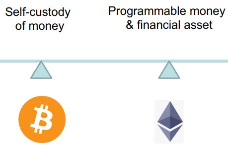<!-- .element height="250px" -->

 `Image taken from Berkely CS294-177 Fall 21` 

---

### Market share of cryptocurrency

- Late 2018 witnessed the first huge MeMe of NFT, i.e., CryptoKitties
- The year of 2021 witnessed the booming dev of DeFi
  - More useful infrastructure building upon Ethereum
  - NFT platforms such as Opensea
- This talk will be Ethereum-centered or ERC-compatible discussion

<!-- .element: style="font-size:65%;" -->

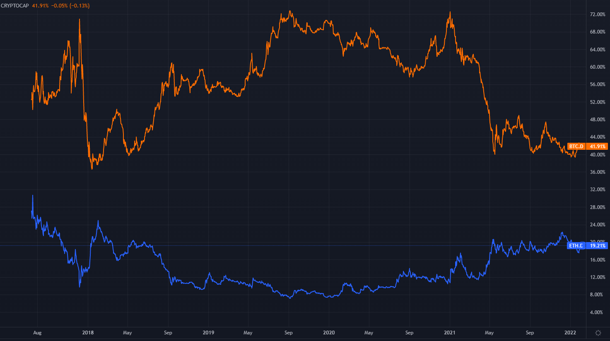<!-- .element height="330px" -->

 `Chart plotting using Tradingview stats` 

---

### Comparison of DeFi and conventional finance

- Collateral *VS* Custodial
- Permissionless *VS* Permissioned
- Public auditable *VS* Centralized trust & governance
- Composability/Programmability *VS* Proprietary infrastructure

 `Werner, Sam M., et al. "Sok: Decentralized finance (defi)." arXiv preprint arXiv:2101.08778 (2021).` 

<!-- .element: style="font-size:65%;" -->

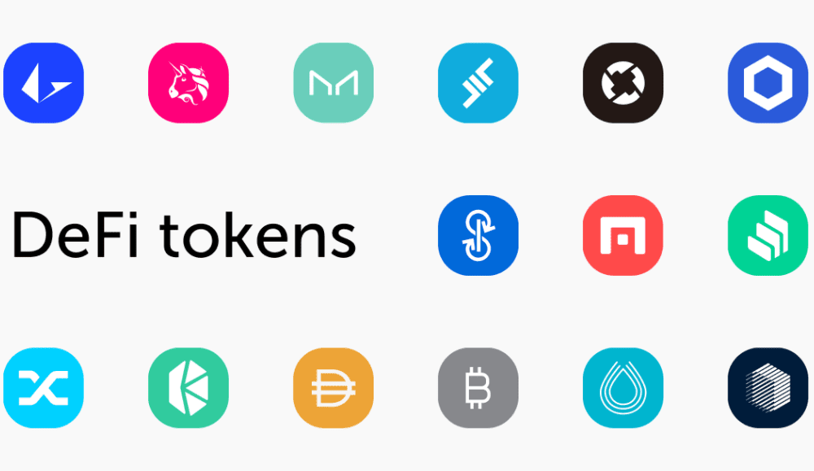<!-- .element height="230px" -->

 `DeFi tokens compatible with Ethereum standards, e.g., ERC20/721` 

---

- What is DeFi?
- **DEX overview**
- CEX practices and revelant researches
- DEX new challenges
- Technical insights

---

### Centralized Exchange

- Permissioned KYC
  - No user privacy
  - Regional differences, e.g., Binance and Binance USA
- Little public transparency
  - Self regulation
  - Just trust the CEX custodian
- Pegged to the reserve-based fiat system (USD) de facto
  - Fractional reserve, e.g., USDT
  - Over-leveraging issues

<!-- .element: style="font-size:60%;" -->

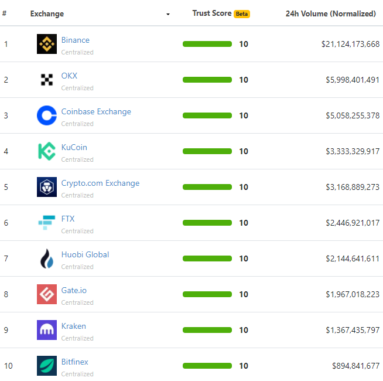<!-- .element height="350px" -->

 `Top 10 CEX as of March 2022` 

---

### DEX

- Decentralized trust
  - Collateral-based
  - Public auditable
  - Spirit of *gold standard*
- Two common scenarios
  - ETH to Uniswap
  - ETH for BTC
    - ETH -> WBTC (ERC-wrapped and pegged stablecoin)
    - Still need to trust custodian BitGo for WBTC
    - But the collaterals (locked assets) of BitGo is publicly auditable 

<!-- .element: style="font-size:60%;" -->

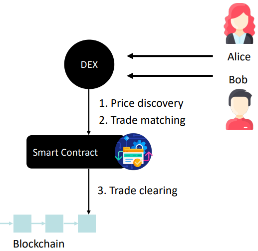

 `P2P exchange enabled by the blockchain` 

---

### Market Making and Liquidity in CEX

- A market maker is an intermediate just like a warehouse
  - You want to sell, instead of going great lengths to find a buyer (**P2P**)
  - You sell to the market maker and then MM sits around and waits for a buyer
  - The price might go down before MM finds another buyer so he charges you a spread
  - Competition drives the MMs to more or less agree the range of spread
- Incentives for MMs:
  - Charge for commission fees for each trade as MM takes risk
  - Maker-taker rebates to incentivize liquidity providers (**Peer-to-pool**)
    - Big leap in 2000s, and HFT afterwards

<!-- .element: style="font-size:60%;" -->

---

### Peer-to-pool exchange

- Realized on-chain liquidity pools?
  - Central-limit order book (continuous double auction)
    - e.g., Serum
  - Batch/Periodic auction
    -  e.g., Gnosis
  - **Automated Market Maker** (AMM)
    - Mainstream practices, e.g., Curve, UniSwap, etc.
    - **Minimized** on-chain states
    - Liquidity mining as an *incentive* mechanism

<!-- .element: style="font-size:60%;" -->

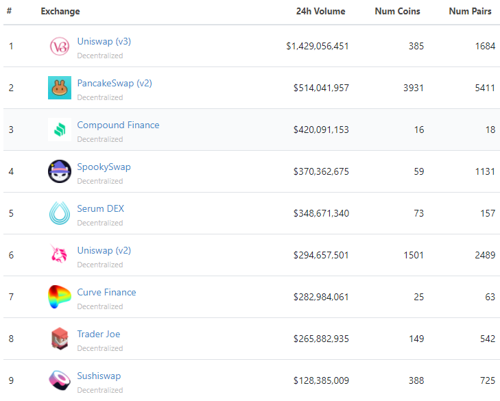

 `Top 9 DEX as of March 2022` 

---

### AMM

- Automated market maker is **algorithmic** in its essence
<!-- - Origin traces back to Savage'71 and Hanson'02 -->
- *Liquidity providers* (LP)
  - Deposit as reserves of the pool
  - Earn passive income from *traders*
- Constant Product MM by Uniswap'18
  - x * y = k
  - k is constant; x and y are the reserves to tokens, A and B
  - price_token_A_relative2_B = reserve_token_B / reserve token_A

 `Xu, et al. "SoK: Decentralized Exchanges (DEX) with Automated Market Maker (AMM) Protocols." arXiv preprint arXiv:2103.12732 (2022).` 

<!-- .element: style="font-size:60%;" -->

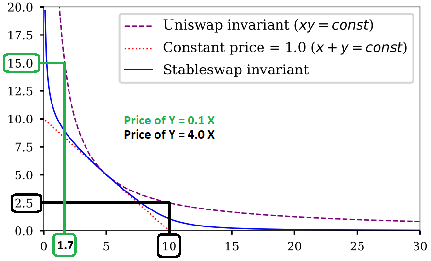

 X axis is amount of asset A reserved 

 Y axis is amount of asset B reserved 

---

### Real-world example

- Uniswap V3 AMM liquidity pool
  - Locks LPs' 3.19k WBTC, 49.60k ETH
  - Price of BTC is thus smaller than 49.6/3.19 due to transaction fees
- Say the market price on Binance jumps to 14.2 ETH/BTC
  - Arbitrage traders buy cheap ETH on Binance, sell it on Uniswap
  - Continuous arbitrage until EQM
  - Huge divergence loss for LPs if there is a big jump

 Angeris, Guillermo, et al. "An analysis of Uniswap markets." arXiv preprint arXiv:1911.03380 (2019). 

<!-- .element: style="font-size:60%;" -->

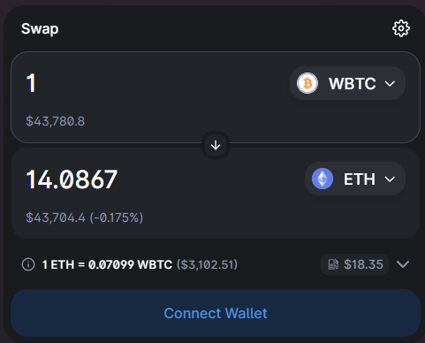

 `WBTC to ETH price quote, given by Uniswap V3, 2022/03/09` 

---

### Universal AMM

- UniSwap V2 is constant product AMM
- UniSwap V3 whitepaper, March 2021
  - **Concentrated liquidity**: LPs can provide custom amounts of liquidity in selected price ranges
  - Amplified virtual reserves
  - (x + x_offset) * (y + y_offset) = k
  - x_offset = sqrt(k / price_upper); y_offset = sqrt(k * price_lower)
- Universality: simulating other AMMs
  -  e.g., StableSwap by Curve, Balancer

<!-- .element: style="font-size:60%;" -->

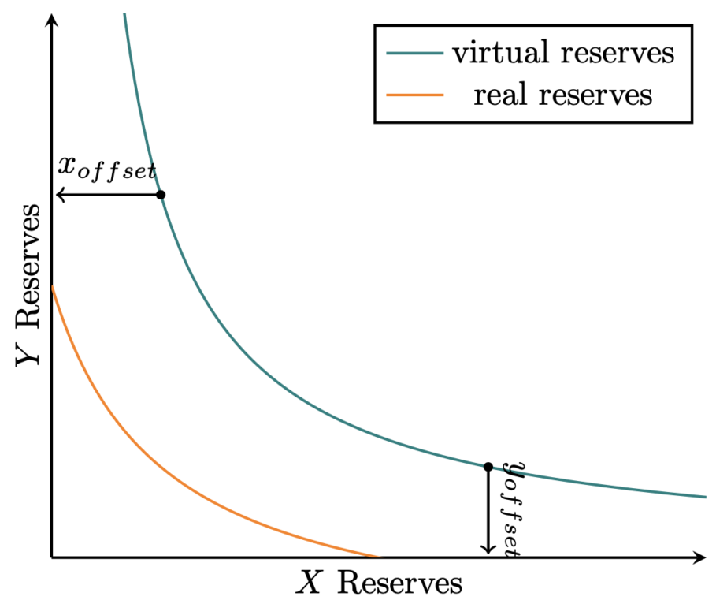

 `Uniswap V3 reserves in a single position` 

---

### Price Impact

- Definition: difference between current market price and expected fill price
- Price impact is a function of
    - Size of your trade relative to the size of the liquidity pool
    - Trading rule being used (e.g. constant product formula)
- Price impact of your order is about **twice** the size of your order relative to pool size (both assets)
- **DEX inherently not feasible for whale orders**
  - Let alone security aspects (more later)
  

<!-- .element: style="font-size:60%;" -->

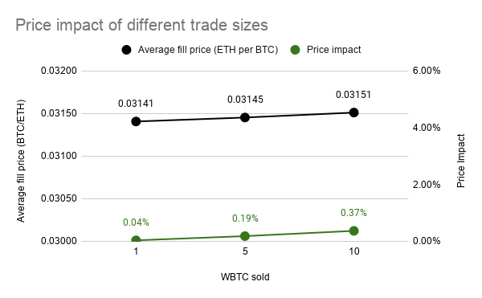

 `Data of WBTC to ETH on Uniswap V2` 

---

- What is DeFi?
- DEX overview
- **CEX practices and revelant researches**
- DEX new challenges
- Technical insights

---

### Block trading

- Price impact in CeFi could also have impact
  - Especially with high-volume institutional trading
- Dark pool introduced and standardized to minimize market impact
  - Typical dark pools:
    - Only specify desired volume and direction (buy/sell)
    - No price specified; prices will be midpoint of National Best Bid and Offer (NBBO) in lit market
    - Essentially provides no price discovery function, instead trade matching only
  - Effects: break trade up over exchanges instead of over time; each dark pool competes for liquidity instead of price

  
<!-- .element: style="font-size:75%;" -->

---

### Auction Abstraction

- First(Second)-price auction, double auction, *batch* auction
- **Continuous** double auction: order book
  - *Double* due to bi-directional trading, e.g., buy and sell
  - Smallest order latency (sub-miliseconds)
- **Periodic batch** auction for *block trades*
  - *Batched* vol/price orders to be matched for maximized volumes
  - Scheduled volume matching
    - Assume a price oracle

  
<!-- .element: style="font-size:60%;" -->

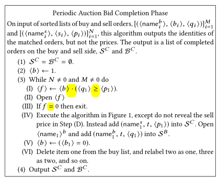

 `Periodic auction algorithm and highlighted integer operations.` 

---

### Security aspects

- Integrity problems and **trust**
  - Price set incorrectly 
  - Orders not matched with counterparties with respect to "priority rules"
- Secrecy: Order information shared/leaked for potential exploit, e.g., order type, volume interest
  - Abused by liquidity providers/market makers
  - Bribed by other traders

  
<!-- .element: style="font-size:60%;" -->

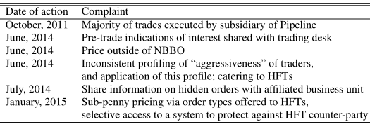

 `Actions of regulatory authorities against dark pools and alternative trading systems.` 

 D.C. Parkes, et al. "Achieving Trust without Disclosure: Dark Pools and a Role for Secrecy-Preserving Verification." at Harvard, 2015. 

---

### Research endeavor on auction

- ZKP with evaluator-prover model
  - A **trusted third party** aggregates results by attaching a correctness proof
  - Majority ZKP constructions [1] leverage PK-based homomorphism commitments
  - Works [2,3] by M.O. Rabin & S. Micali use customized ZK for efficient comparison
  - Most efficient scheme [2]: ZKP + SGX (abstracted by black box commitments)
- MPC to alleviate the trust concerns
  - First seminal work to replace TTP with MPC: [4]
  - More concrete construction in [5] and actual **dark pool evaluation** results in [6]

  
<!-- .element: style="font-size:60%;" -->

1. C. Thorpe et. al., "Cryptographic Combinatorial Securities Exchanges", In Proc. of FC, 2009
2. M.O. Rabin et.al., "Strictly-Black-Box Zero-Knowledge and Efficient Validation of Financial Transactions", In Proc. of ICALP, 2012
3. M.O. Rabin et.al., "Cryptography miracles, secure auctions, matching problem verification", Comm. of the ACM, 2014
4. Damgard et.al., "A Practical Implementation of Secure Auctions Based on Multiparty Integer Computation", In Proc. of FC, 2006
5. C.S. Jutla, "Upending Stock-Market Structure Using Secure Multi-Party Computation", IBM Research, 2015
6. J. Cartlidge et.al., "MPC Joins The Dark Side", In Proc. of AsiaCCS, 2019

<!-- .element: style="font-size:40%;" -->

---

- What is DeFi?
- DEX overview
- CEX practices and revelant researches
- **DEX new challenges**
- Technical insights

---

### DEX security

- **On-chain secrecy**
  - Order infomration hidden (at least throughout trading procedures)
  - Strong secrecy: hidden after successful trades
- **Frontrunning** [1]
  - Miners incentivized to manipulate the transaction order
  - Formalized with miner extractable value (MEV)
- *Trust decentralization*
  - who performs the computation?
- *Computation correctness*
  - Public verifiability
  - Discourage misbehaviors with **minimized** costs and impacts

  
<!-- .element: style="font-size:75%;" -->

1. Baum et.al., SoK: Mitigation of Front-running in Decentralized Finance, eprint, 2021

<!-- .element: style="font-size:50%;" -->

---

- What is DeFi?
- DEX overview
- CEX practices and revelant researches
- DEX new challenges
- **Technical insights**

---

### Preserving Secrecy and Addressing Frontrunning

- Commit-and-reveal approach
  - Commit stage to hide and bind secret values
  - Commit stage to internalize orders 
    - Mitigate frontrunning attacks
    - Auction matching procedures take place after revealing
  - Essentially match with **periodic batch** auctions
    - Batching works well when the distribution of trade sizes is concentrated

  
<!-- .element: style="font-size:60%;" -->

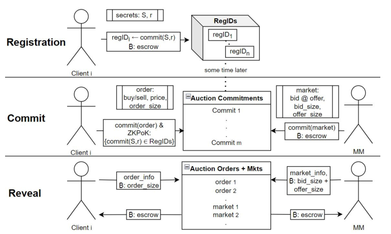

 `Overview of the general commit & reveal approach.` 

 Figure taken from FairTraDEX: A Decentralised Exchange Preventing Value Extraction, eprint 2022
 

 

---

### DEX computation stage

- RECALL THAT in CeFi settings:
- ZKP with evaluator-prover model
  - A **trusted third party** aggregates results by attaching a correctness proof
  - Majority ZKP constructions [1] leverage PK-based homomorphism commitments
  - Works [2,3] by M.O. Rabin & S. Micali use customized ZK for efficient comparison
  - Most efficient scheme [2]: ZKP + SGX (abstracted by black box commitments)
- MPC to alleviate the trust concerns
  - First seminal work to replace TTP with MPC: [4]
  - More concrete construction in [5] and actual **dark pool evaluation** results in [6]

  
<!-- .element: style="font-size:60%;" -->

1. C. Thorpe et. al., "Cryptographic Combinatorial Securities Exchanges", In Proc. of FC, 2009
2. M.O. Rabin et.al., "Strictly-Black-Box Zero-Knowledge and Efficient Validation of Financial Transactions", In Proc. of ICALP, 2012
3. M.O. Rabin et.al., "Cryptography miracles, secure auctions, matching problem verification", Comm. of the ACM, 2014
4. Damgard et.al., "A Practical Implementation of Secure Auctions Based on Multiparty Integer Computation", In Proc. of FC, 2006
5. C.S. Jutla, "Upending Stock-Market Structure Using Secure Multi-Party Computation", IBM Research, 2015
6. J. Cartlidge et.al., "MPC Joins The Dark Side", In Proc. of AsiaCCS, 2019

<!-- .element: style="font-size:40%;" -->

----

- State-of-the-art research works w.r.t DEX:
- Designated TTP operator with ZKP
  - FairMM [1]: TTP obtains the traders' orders in plaintext and performs verifiable computation to ensure transaction orders 
  - FC'21 [2]: Traders encrypt their orders using the TTP's public key; TTP provides a ZK range proof verifying the correct execution of orders
  - Block Auction [3]: Protect metadata such as trade direction, trader identity, etc.
- MPC to replace TTP
  - FuturesMEX [4]: First MPC version of distributed exchange with claimed anonymity, but not consider blockchain applicability
  - P2DEX [5]: Off-chain MPC protocol run by servers using threshold secret-sharing
- zksnark over *AMM*
  - Manta [6]: Generation of an offline ZKP proof needs 15 seconds.

  
<!-- .element: style="font-size:60%;" -->

1. Ciampi et. al., "Fairmm: A fast and frontrunning-resistant crypto market-maker", eprint, 2021.
2. Galal et.al., "Publicly verifiable and secrecy preserving periodic auctions", In Proc. of FC, 2021
3. Constantinides et. al., "Block auction: A general blockchain protocol for privacy-preserving and verifiable periodic double auctions", In Proc. of Conference on Blockchain, 2021
4. Massacci et. al., "Futuresmex: Secure, distributed futures market exchange", In Proc. of S&P, 2018.
5. Baum et. al., "P2dex: Privacy-preserving decentralized cryptocurrency exchange", Applied Cryptography and Network Security, 2021.
6. Chu et. al., "Manta: a Plug and Play Private DeFi Stack", eprint, 2021

  
<!-- .element: style="font-size:40%;" -->

---

### Insights and Problems

- Hawk-alike [1] TTP appointed computation is formalized for generic computational tasks
  - Could serve as an intuitive `baseline` solution
  - But trust is anchored to a single party, not decentralized
    - Single point of failture
    - Concerns such as potential bribing and colluding, especially for our application with hugh monetary incentives
- Threshold trust with MPC-based design
  - Replace `1` TTP with `n` TTPs, assuming at most `t` TTPs are corrupt
    - Assume input clients can communicate **privately** with TTPs
    - Many input clients (traders) *interact* with `n` TTPs
    - Typical values of (n, t) in demonstrated experiments might be (3,1) or (5,2)
  - Inherent trade-offs between trust and communication
    - Unconditional secrecy channel number rapidly increases with `n` (i.e., O(n^2))
    - To mitigate colluding, `n` should be sufficiently large
  - Not publicly verifiable if things go wrong

  
<!-- .element: style="font-size:60%;" -->

1. Kosba et. al., "Hawk: The blockchain model of cryptography and privacy-preserving smart contracts", In Proc. of S&P, 2016.

  
<!-- .element: style="font-size:40%;" -->

---

### Breaking up block trades

- Addition, multiplication, inequality comparison requires generic MPC
  - Unnecessarily expensive and complex in decentralized settings
- Consider a `bucketized` volume matching scheme inspired by [1]
  - Orders can only be executed in a number of fixed bucket sizes, e.g., 10^2, 10^3, ...
  - To preserve secrecy, traders can submit `dummy` bucket
  - **Essence**: splitting (inverse of batching) within a batch period
- Customized security design for efficient computation over boolean AND/OR operations
- Inspiration from flourish researches in blockchain-enabled evoting
  - Prevalently used for Decentralized Autonomous Organization (DAO) 
  - Two works [2,3] adopt this idea in auctioneer-free first-price auction
  - Each binary vote ballot can be regarded as a `bucket` in our *batch* auction scenario
    - Binary AND instead of Binary OR in first-price auction
  - Can use the formalized framework directly 

 
<!-- .element: style="font-size:60%;" -->

1. Gama et. al., "Kicking-the-Bucket: Fast Privacy-Preserving Trading Using Buckets", eprint, 2021.
2. Bag et. al., "SEAL: Sealed-Bid Auction without Auctioneers", TIFS, 2019
3. David et. al., "FAST: Fair Auctions via Secret Transactions", eprint, 2021

  
<!-- .element: style="font-size:40%;" -->

---

### Off-chain computation

- Computation is `self-enforced`, volume data is `self-aggregated` among traders
- Intuition behind
  - Combines everyone else's public key to encrypt data and send to the blockchain
  - But requires no private keys to decrypt it later (intermediate results cancelled out)
  - Rarely exploited exc. e-voting
- Two rounds of computation and interaction are required
  - Commit and Compute total number of effective buckets
  - Input blinding and packing in the first round, self-aggregation in the second round

  
<!-- .element: style="font-size:50%;" -->

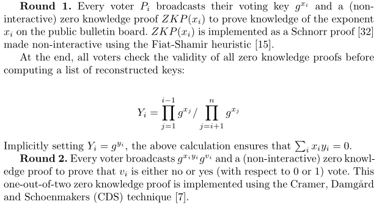

 `A two-round distributed voting protocol.` 

 Figure taken from A Smart Contract for Boardroom Voting with Maximum Voter Privacy, 2017
 

 

---

### On-chain Matching

- Assume each trader has two accounts for a target trading pair 
- Time-Weighted Average Price from the price oracle
- After obtaining bucket number for buy and sell (superset of effective volumes)
- Orders that arrived first will be matched first
  - Check the order is effective (in contrast to dummy)
    - Set an expiration time period
    - Traders open the order commitment or **update** the deposit commitment through arithmetized boolean expression [1] (privacy-preserving)
  - Rank all verified orders according to timestamps attached with sumbitted orders in the first round
  - Unmatched orders are returned
- Rewarding dummy orders proportionally
- Security leakage
  - Buy/Sell interests (though dummy orders exist)
  - Executed orders (after matching phase), unmatched orders

 
<!-- .element: style="font-size:60%;" -->

1. Crite et.al., "Reputable List Curation from Decentralized Voting", Proc. of PETS, 2020

  
<!-- .element: style="font-size:40%;" -->

---

### Recall that

- On-chain secrecy &check;
  - Order infomration hidden (at least throughout trading procedures)
  - Strong secrecy: hidden after successful trades
- Frontrunning &check;
  - Miners incentivized to manipulate the transaction order
  - Formalized with expected extractable value
- Trust decentralization &check;
  - who performs the computation?
- *Computation correctness*
  - Public verifiability &check;
  - Discourage **misbehaviors** with **minimized** costs
    - i.e., fault tolerance and fairness
    - Affordable active security

  
<!-- .element: style="font-size:75%;" -->

----

### Two-way approach

- Incentive mechanism to discourage misbehaviors among rational players
  - Secret deposits through binding and hiding commitment
  - Depend on a committee using publicly verifiable secret sharing to punish wrongdoers [1]
  - Tied with the first round to screen traders
- Fault tolerance and robustness
  - Re-executing is too expensive if a trader deliberately misbehaves
  - Introduce a recovery round in case of abortion in the second round

  
<!-- .element: style="font-size:75%;" -->

1. David et. al., "FAST: Fair Auctions via Secret Transactions", eprint, 2021
2. Khader et. al., "A Fair and Robust Voting System by Broadcast", 2012
3. Venugopalan et. al., "BBB-Voting: Self-Tallying 1-out-of-k Blockchain-Based Boardroom Voting', eprint, 2020

  
<!-- .element: style="font-size:40%;" -->

---

### Performance considerations

- Design space: enable support of different bucket sizes, i.e., 1-out-of-k bucket choices instead of binary
- Latency of periodic batch auction
  - Intervals between 10 and 45 seconds
  - Following current incarnations of dark pools such as Posit Match and LSE's Turquoise
- Throughput, i.e., number of concurrent traders in a batch
  - Bottleneck is the on-chain storage penalties, i.e., O(n)

  
<!-- .element: style="font-size:75%;" -->

---

### Possible Further Directions

- Bucketized design constrains the order sizes
- Differential privacy as an add-on
  - Two works [1,2] mention the use of DP in constant function AMM
  - Use LDP and Verifiable Random Function (VRF)
    - Add noise to the price [1]
    - Add noise when splitting up large trades [2]
    - Add noise for permuting the split up trades' ordering [2]
    - Publicly verifiable through VRF
- Combine bucketized design and DP upon splitting up

  
<!-- .element: style="font-size:75%;" -->

1. Angeris et. al., "A Note on Privacy in Constant Function Market Makers", eprint, 2021
2. Chitra et. al., "Differential Privacy in Constant Function Market Makers", eprint, 2021

  
<!-- .element: style="font-size:40%;" -->

---

# Q & A

